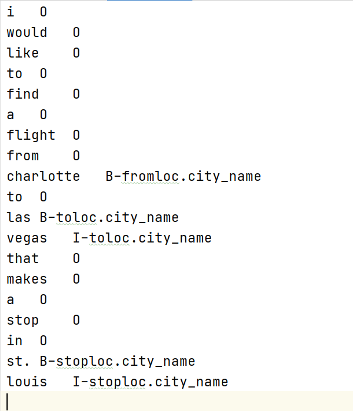

# 基于BI-LSTM的序列标注（easy）

**load_conll_data函数**：

每一个训练数据的形式为：



故先以\n\n分隔每个训练数据，对每个训练数据每一行放入data和label中。

**load_my_json_data函数**：读取json数据

**load_data函数**：调用上述load_conll_data,load_my_json_data函数读取巡礼那数据，测试数据等

**make_dict函数**：为train,test,dev数据中的所有label标签以及所有单词建立到整数的字典索引word2id,label2id以及id2label

**load_embedding函数：**这里使用glove词向量以获取所有的词嵌入.保存到pytorch初始化的embedding_layer中

**create_one_batch函数：**给定一个batch对应的text和label返回一个batch的向量表示。

lst为顺序获取batch的索引。

如果sort为真则根据batch中每个句子的长度对lst的索引（获取batch的索引）由从大到小的顺序排序。

然后根据lst重新将batch按一定的顺序摆放，将其分别看作x（原始数据）和y（label）。同时获取每个数据的长度lens，并获取最大长度maxlen。

获取上述建立字典中out_of_vocab,pad_id以及label_pad_id**词对应的下标**

最后分别创建batch_x和batch_y维度都是(bsz,max_len)分别表示对应的token id和label id。

**create_batches函数：**用于获取所有的Batch。输入的是所有数据对应的word和label

打乱训练数据可以提升训练效果。blens用于保存每个batch的序列实际长度。

最终返回结果batches_x中每个元素是一个tensor维度(bsz,max_len)表示当前batch的向量表示，一共有n_batch个。结果中batches_y中每个元素是一个标签。

**Classifier类**：（使用线性函数层进行标签分类的模块）

该类为**线性分类层**

log softmax函数：$Logsoftmax(x_i) = \log (\frac{exp\{x_i\}}{\sum_j exp\{x_j\}})$

建立logsoftmax层：

```python
self.logsoftmax = nn.LogSoftmax(dim=2) # logsoftmax learn details on https://pytorch.org/docs/stable/generated/torch.nn.LogSoftmax.html

```

在最后一个维度即num_tag的维度上进行归一化。

建立negtiveloglikelihood损失函数。

```python
self.criterion = nn.NLLLoss(tag_weights) # negtive loglikelihood loss learn details on https://pytorch.org/docs/stable/generated/torch.nn.NLLLoss.html
```

forward函数：

tag_score的维度为(batch_size, seq_len, n_tag)

计算NLL时只需传入展开后的tag_score和y向量。

经过self.crition的维度应该是bsz*序列长度每个元素包含的是序列每个元素的likelihood。

计算出的tag_score的维度应该是bsz*seqlen

**Model类**：使用Bi-LSTM的encoder编码器和线性层的decoder解码器的序列标注器。

构造函数建立LSTM模型，建立上述CLASSIFIER模型。

forawrd函数将实例通过encoder输出output和hidden。

再将output通过上述CLASSFIER模型的前向传播。

最终输出结果和计算获得的损失。

```python
    def forward(self, batch_x, batch_y):
        start_time = time.time() # get local time for log
        batch_size, seq_len = batch_x.size(0), batch_x.size(1)
        # get embeddings and move it to cuda
        word_emb = self.embedding_layer(Variable(batch_x).cuda() if self.use_cuda else Variable(batch_x))
        # dropout
        word_emb = F.dropout(word_emb, self.opt.dropout, self.training)

        if not self.training:
            self.emb_time += time.time() - start_time

        start_time = time.time()

        if self.opt.encoder.lower() == 'lstm':
            # put the word embedding through the bilstm encoder
            output, hidden = self.encoder(word_emb)
        else:
            raise ValueError('unknown encoder: {0}'.format(self.opt.encoder))

        if self.training:
            self.train_time += time.time() - start_time
        else:
            self.eval_time += time.time() - start_time
        start_time = time.time()
        # put hidden state from bilstm through linear decoder to compute output and loss
        output, loss = self.classify_layer.forward(output, batch_y)
        if not self.training:
            self.classify_time += time.time() - start_time

        return output, loss
```

**train_model函数**：函数输入已经得到的batch的tensor表示的列表，在整个训练集上运行一遍反向传播。

lst为将batch进行排序的索引。

遍历每个batch，将其输入模型执行前向传播。进行梯度修剪后执行反向传播(optim.step)

遍历完整个训练集后，调用eval函数评估一次模型。

如果评估后的结果大于已有最好的结果，则更新保存模型并在测试集上测试一次模型(调用eval函数)

**eval_model函数**：评价模型 这里不再赘述

**train_and_test函数：**

载入数据后建立单词和label的索引。再建立一个模型。

设置优化器。

max_epcho次遍历训练集。

再Optim处设置学习率衰减。

```python
        if opt.lr_decay > 0:
            optimizer.param_groups[0]['lr'] *= opt.lr_decay 
```


